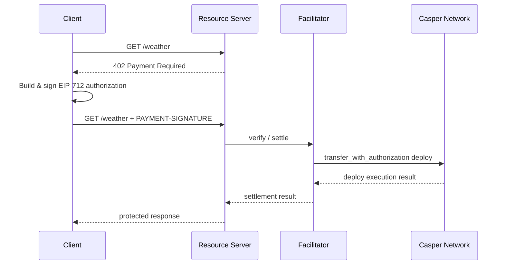

# Casper x402

This monorepo hosts two parallel implementations of the
[x402 payment protocol](https://x402.org) for the
[Casper Network](https://casper.network). Both add Casper as a supported
network to the x402 ecosystem so HTTP APIs can require micropayments settled
on-chain using CEP-18 tokens authorized via EIP-712 signatures.

| Implementation | Path | Description |
|----------------|------|-------------|
| **Go** | [`go/`](go/) | x402 server middleware, Casper signers and reference facilitator / resource server / client / CSPR.click React app built on the official Casper Go SDK |
| **TypeScript** | [`js/`](js/) | `@make-software/casper-x402` package — drop-in mechanism for Node.js, plus Express-based facilitator / server / client demos backed by `casper-js-sdk` |

Both implementations target the same `casper:*` CAIP-2 family and the same
CEP-18 `transfer_with_authorization` entry point, so a client built against
one interoperates with a server or facilitator written in the other.

---

## What is x402?

x402 is an open standard for internet-native payments over HTTP. When a client
requests a paid resource:

1. The resource server responds with `402 Payment Required` plus
   `PaymentRequirements` describing accepted networks, schemes, prices and
   assets.
2. The client builds a `PaymentPayload` — an EIP-712 signed authorization —
   and replays the request with a `PAYMENT-SIGNATURE` header.
3. The resource server forwards the payload to a **facilitator** for
   verification and, on success, for on-chain settlement.
4. The facilitator submits a Casper `transfer_with_authorization` deploy to the
   CEP-18 contract and waits for confirmation.
5. The resource server returns the protected response.

Both implementations support the `exact` scheme on the `casper:*` CAIP-2
family, backed by the
[casper-ecosystem/casper-eip-712](https://github.com/casper-ecosystem/casper-eip-712)
typed-data specification.

---

## Architecture


_Source: [go/docs/architecture.mmd](go/docs/architecture.mmd)_

The sequence is identical across both implementations:


```mermaid
sequenceDiagram
    participant C as Client
    participant R as Resource Server
    participant F as Facilitator
    participant N as Casper Network

    C->>R: GET /weather
    R-->>C: 402 Payment Required
    C->>C: Build & sign EIP-712 authorization
    C->>R: GET /weather + PAYMENT-SIGNATURE
    R->>F: verify / settle
    F->>N: transfer_with_authorization deploy
    N-->>F: deploy execution result
    F-->>R: settlement result
    R-->>C: protected response
```

---

## Repository layout

```
casper-x402/
├── go/        # Go implementation      — see go/README.md
├── js/        # TypeScript implementation — see js/README.md
└── infra/     # Local NCTL stack + Dockerfiles that build both implementations
```

- **[go/README.md](go/README.md)** — Go module, internal packages, demo apps
  (facilitator, resource server, client, CSPR.click React app) and per-binary
  configuration.
- **[js/README.md](js/README.md)** — `@make-software/casper-x402` package,
  Express-based facilitator / server / client demos and TypeScript toolchain.
- **[infra/](infra/)** — Docker Compose stack that wires a local NCTL node, the
  CEP-18 token deployer, and Dockerfiles that build the Go binaries and the
  CSPR.click React app.

---

## License

This project is licensed under the [Apache License 2.0](./LICENSE).
