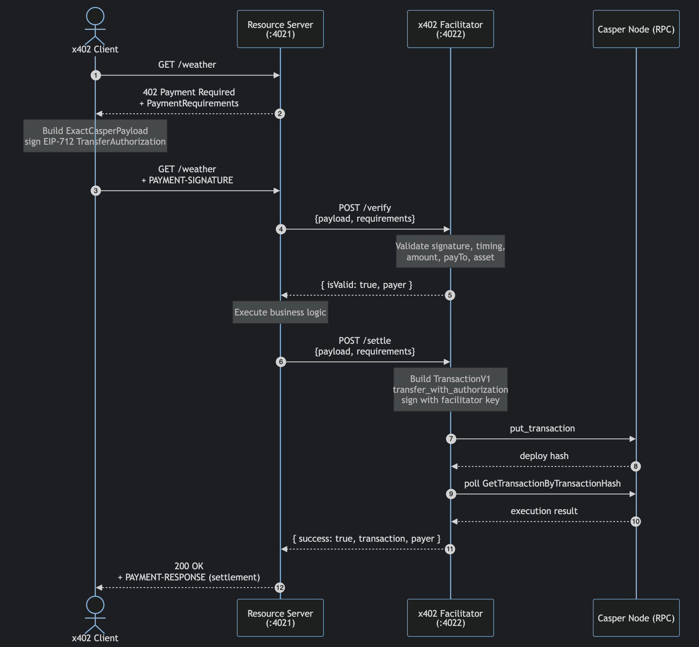

# Casper x402 Facilitator

A Go implementation of the [x402 payment protocol](https://x402.org) for the
[Casper Network](https://casper.network). It adds Casper as a supported network
to the x402 ecosystem so HTTP APIs can require micropayments settled on-chain
using CEP-18 tokens authorized via EIP-712 signatures.

This repository delivers four components:

| Component | Purpose | Port |
|-----------|---------|------|
| **Facilitator** (`examples/facilitator`) | x402 facilitator HTTP server — verifies signatures and settles payments on Casper | `4022` |
| **Resource Server** (`examples/server`) | Demo Gin server that exposes a paid `GET /weather` endpoint protected by x402 | `4021` |
| **Client** (`examples/client`) | Headless demo client that consumes the paid endpoint and signs a payment authorization | — |
| **CSPR.click Web App** (`examples/csprclick-x402`) | React application using CSPR.click to manage the signature of EIP-712 typed data for x402 payments | `4020` |

The core payment scheme lives under
[`x402/mechanisms/casper/`](x402/mechanisms/casper) and integrates with the
upstream [`github.com/x402-foundation/x402/go`](https://github.com/x402-foundation/x402)
package as a pluggable mechanism for the `casper:*` CAIP-2 family.

---

## What is x402?

x402 is an open standard for internet-native payments over HTTP. When a client
requests a paid resource:

1. The resource server responds with `402 Payment Required` plus
   `PaymentRequirements` describing accepted networks, schemes, prices and
   assets.
2. The client builds a `PaymentPayload` — an EIP-712 signed authorization — and
   replays the request with a `PAYMENT-SIGNATURE` header.
3. The resource server forwards the payload to a **facilitator** for
   verification and, on success, for on-chain settlement.
4. The facilitator submits a Casper `transfer_with_authorization` deploy to the
   CEP-18 contract and waits for confirmation.
5. The resource server returns the protected response.

This repository implements the `exact` scheme on the `casper:*` network family,
backed by the
[casper-ecosystem/casper-eip-712](https://github.com/casper-ecosystem/casper-eip-712)
typed-data specification.

## Architecture



_Source: [docs/architecture.mmd](docs/architecture.mmd)_

Under the hood:

- `x402/mechanisms/casper/exact/client` builds signed `ExactCasperPayload`
  values using the `ClientCasperSigner` interface.
- `x402/mechanisms/casper/exact/facilitator` validates signatures, time
  bounds, amounts and addresses, then assembles a `TransactionV1` calling the
  CEP-18 `transfer_with_authorization` entry point.
- `x402/mechanisms/casper/exact/server` ships the server-side plumbing
  consumed by the upstream x402 Gin middleware (`ParsePrice`,
  `EnhancePaymentRequirements`, asset/decimal registration).
- `x402/signers/casper` provides concrete implementations of the
  `ClientCasperSigner` and `FacilitatorCasperSigner` interfaces backed by the
  Casper Go SDK (`github.com/make-software/casper-go-sdk/v2`).

## Requirements

- Go `1.25+`
- A funded Casper account (ED25519 or SECP256K1) for the facilitator
- A deployed CEP-18 x402 token contract (`Cep18X402.wasm` is provided under
  [`infra/local/deployer`](../infra/local/deployer) for local/testnet testing)
- Access to a Casper JSON-RPC endpoint (testnet, mainnet, or local NCTL)

## Quick start

### 1. Install dependencies

```bash
cd go
go mod download
```

### 2. Configure environment variables

Copy the provided `.env` template into the `./go` folder and fill in values. Or use `.env.testnet` if you're going to test on the Testnet network with WCSPR contract.

### 3. Run the services

In three separate terminals:

```bash
# Terminal 1 — facilitator
go run ./examples/facilitator

# Terminal 2 — resource server
go run ./examples/server

# Terminal 3 — client (performs a paid request)
go run ./examples/client
```

On success, the client prints the weather response and the facilitator logs a
`settle: success=true deploy=<hash>` line for the submitted Casper deploy.

## Project layout

```
casper-x402/go/
├── examples/
│   ├── facilitator/       # x402 facilitator HTTP server (:4022)
│   ├── server/            # demo resource server (:4021)
│   ├── client/            # demo headless client
│   └── csprclick-x402/    # React + CSPR.click typed-data signing demo
├── x402/
│   ├── mechanisms/casper/ # exact-scheme client/server/facilitator + shared types
│   └── signers/casper/    # Casper SDK-backed signer implementations
├── internal/              # private packages (logger, gin middleware)
├── docs/                  # this documentation set
└── go.mod
```

## Documentation

- **[docs/user-guide.md](docs/user-guide.md)** — installation, configuration
  and how to run the facilitator, resource server and client.
- **[docs/api-reference.md](docs/api-reference.md)** — HTTP endpoints,
  payload/requirement shapes, exported Go types and interfaces.

## Testing

```bash
# Run the full suite
go test ./...

# Scoped to a package
go test ./x402/mechanisms/casper/exact/facilitator/...
```

## License

This project is licensed under the [Apache License 2.0](../LICENSE).
