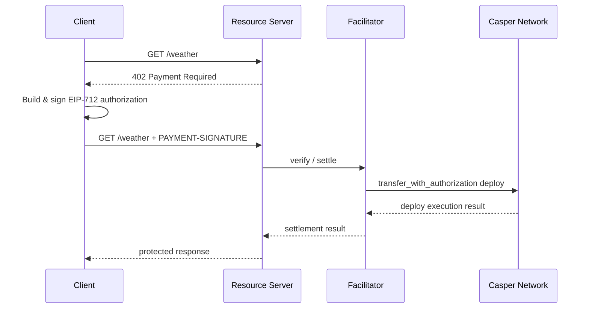

# Casper x402 Facilitator (TypeScript)

A TypeScript implementation of the [x402 payment protocol](https://x402.org) for the [Casper Network](https://casper.network). It adds Casper as a supported network to the x402 ecosystem so HTTP APIs can require micropayments settled on-chain using CEP-18 tokens authorized via EIP-712 signatures.

This repository is the TypeScript sibling of [`make-software/casper-x402`](https://github.com/make-software/casper-x402) (Go).

---

## What is x402?

x402 is an open standard for internet-native payments over HTTP. When a client requests a paid resource:

1. The resource server responds with `402 Payment Required` plus `PaymentRequirements` describing accepted networks, schemes, prices and assets.
2. The client builds a `PaymentPayload` — an EIP-712 signed authorization — and replays the request with a `PAYMENT-SIGNATURE` header.
3. The resource server forwards the payload to a **facilitator** for verification and, on success, for on-chain settlement.
4. The facilitator submits a Casper `transfer_with_authorization` deploy to the CEP-18 contract and waits for confirmation.
5. The resource server returns the protected response.

This repository implements the `exact` scheme on the `casper:*` CAIP-2 family, backed by the [casper-ecosystem/casper-eip-712](https://github.com/casper-ecosystem/casper-eip-712) typed-data specification.

---

## Components

| Component | Path | Purpose |
|-----------|------|---------|
| **Casper mechanism package** | `packages/mechanisms/casper` | Published as `@make-software/casper-x402`; provides client/server/facilitator schemes and Casper signers |
| **Resource server example** | `examples/server` | Express.js server that exposes a paid `GET /weather` endpoint |
| **Facilitator example** | `examples/facilitator` | Express.js service that verifies signatures and settles payments on Casper |
| **Client example** | `examples/client` | Headless client that consumes the paid endpoint and signs payment authorizations |

---

## Architecture



Under the hood:

- `exact/client` builds signed `ExactCasperPayload` values using the `ClientCasperSigner` interface.
- `exact/server` validates asset/payee addresses, parses prices, and produces payment requirements.
- `exact/facilitator` verifies signatures, time bounds, amounts and addresses, then assembles a Casper transaction calling the CEP-18 `transfer_with_authorization` entry point.
- `signer.ts` provides concrete implementations of the client and facilitator signer interfaces backed by [`casper-js-sdk`](https://github.com/casper-ecosystem/casper-js-sdk).

---

## Installation

```bash
npm install @make-software/casper-x402
```

Peer / transitive dependencies include `@x402/core`, `casper-js-sdk` and `@casper-ecosystem/casper-eip-712`.

---

## Examples

See [`examples/README.md`](examples/README.md) for a step-by-step guide to running a resource server, facilitator and client together.

---

## Project layout

```
x402-ts/
├── packages/
│   └── mechanisms/casper/   # @make-software/casper-x402 package
│       ├── src/
│       │   ├── exact/client/
│       │   ├── exact/server/
│       │   ├── exact/facilitator/
│       │   ├── signer.ts
│       │   ├── types.ts
│       │   ├── utils.ts
│       │   └── constants.ts
│       └── test/
└── examples/
    ├── server/              # Paid Express endpoint demo
    ├── facilitator/         # x402 facilitator service demo
    └── client/              # Headless paying client demo
```

---

## Development

This repository is a pnpm workspace. Install dependencies once from the root:

```bash
pnpm install
```

Build the package:

```bash
pnpm build
```

Run tests:

```bash
pnpm test
```

Format and lint:

```bash
pnpm format
pnpm lint
```

You can still run package-specific scripts by changing into `packages/mechanisms/casper` or by using `pnpm --filter @make-software/casper-x402 <script>`.

---

## Network identifiers

Casper networks use [CAIP-2](https://github.com/ChainAgnostic/CAIPs/blob/main/CAIPs/caip-2.md) format:

- `casper:casper` — Casper Mainnet
- `casper:casper-test` — Casper Testnet

These are exported as `NETWORK_CASPER_MAINNET` and `NETWORK_CASPER_TESTNET` from the package root.

---

## License

This project is licensed under the Apache License 2.0.
